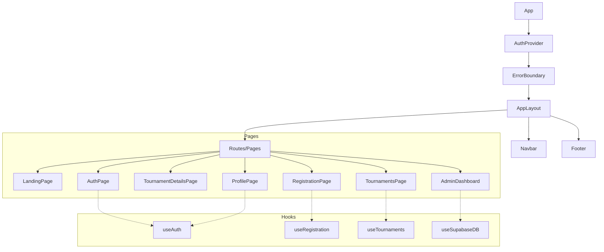
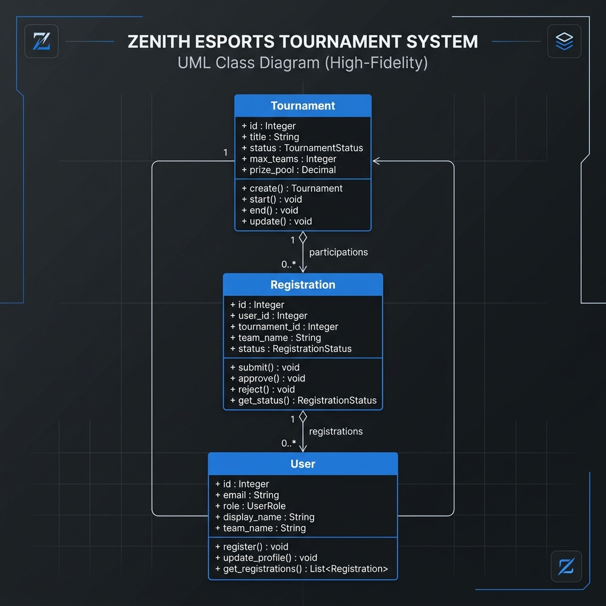
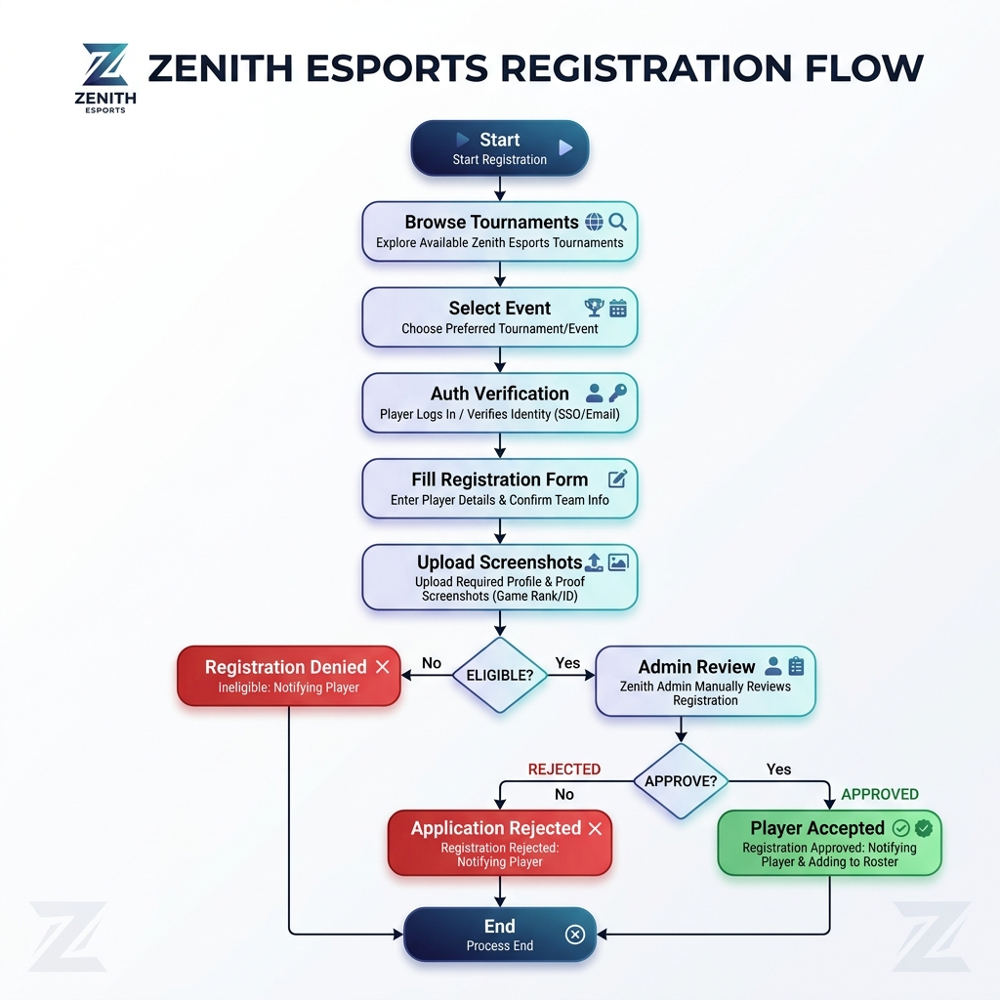

# Zenith Esports - Project Documentation
**Version:** 1.0.6.0  
**Developer:** Taha Zaman  
**Date:** May 5, 2026  
**GitHub Repository:** [tahazamancheema/zenithesports](https://github.com/tahazamancheema/zenithesports)

---

## 1. Introduction
Zenith Esports is a premium tournament management platform designed for competitive gaming, specifically tailored for mobile titles like PUBG Mobile. It provides a seamless experience for players to discover tournaments, register teams, and for administrators to manage the competitive lifecycle.

---

## 2. System Architecture (Component Relations)
The application follows a modular React architecture with centralized state management via Context API and real-time data persistence through Supabase.

### 2.1 Component Tree (Class Relations)
In the React context, "Class Relations" are represented by the component hierarchy and data flow.

---

## 3. Data Model (UML Class Diagram)
The following UML Class Diagram represents the core data entities and their relationships within the Supabase PostgreSQL database.

---

## 4. Activity Diagram: Tournament Registration
This diagram illustrates the logical flow of a user registering for a competitive event, including authentication and admin review.

---

## 5. Use Cases

### UC-01: Team Registration
*   **Actor:** Player (Captain)
*   **Description:** The captain registers their team for an upcoming tournament by providing player details and social media verification screenshots.
*   **Pre-condition:** User must be authenticated.
*   **Post-condition:** A registration record is created with a 'pending' status.

### UC-02: Tournament Management
*   **Actor:** Administrator
*   **Description:** The admin creates new tournaments, sets prize pools, and manages registration deadlines.
*   **Pre-condition:** User must have the 'admin' role.
*   **Post-condition:** Tournament details are updated in the database and visible to all users.

### UC-03: Competitive Eligibility Verification
*   **Actor:** System
*   **Description:** The system automatically checks if players listed in a new registration are already registered in the same tournament under a different team to prevent double-entry.
*   **Pre-condition:** Registration form is submitted.
*   **Post-condition:** Registration is either allowed or blocked based on data integrity rules.

### UC-04: Profile Management
*   **Actor:** Player
*   **Description:** A player updates their permanent team profile (logo, member IGNs). This data automatically populates future registration forms to speed up the process.
*   **Pre-condition:** User is logged in.
*   **Post-condition:** User record is updated in the `users` table.

---

## 6. Version History
| Version | Date | Changes | Developer |
| :--- | :--- | :--- | :--- |
| 1.0.0.0 | 2026-04-20 | Initial Project Architecture & Supabase Setup | Taha Zaman |
| 1.0.2.0 | 2026-04-25 | Real-time Tournament Data Synchronization | Taha Zaman |
| 1.0.4.0 | 2026-04-30 | Landing Page Redesign & UI Performance Optimization | Taha Zaman |
| 1.0.5.0 | 2026-05-02 | Tournament Registration Workflow & Duplicate Checks | Taha Zaman |
| 1.0.6.0 | 2026-05-05 | Final Polish, Documentation, and Stability Fixes | Taha Zaman |
